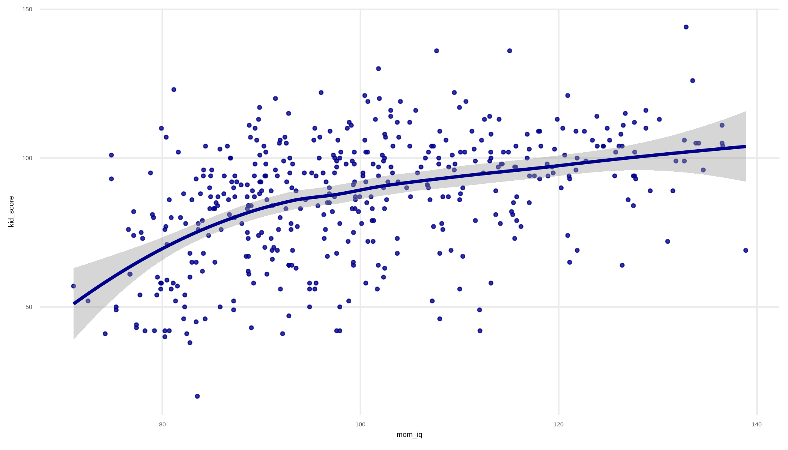
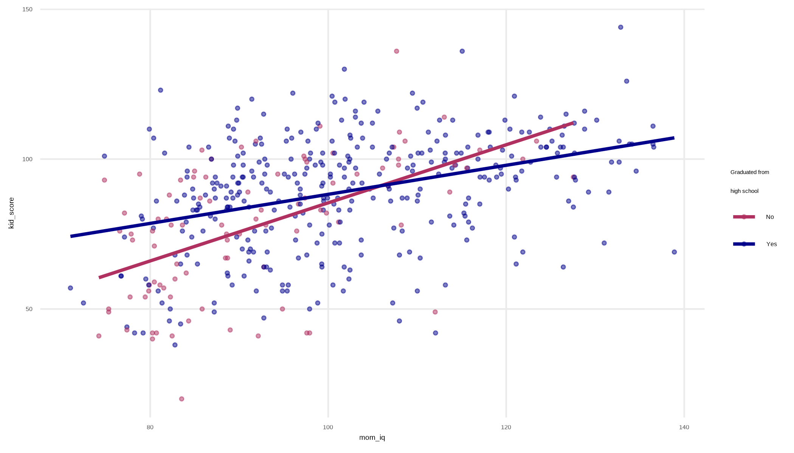

#####
```{r global_options, include=F}
# standard figure size and generate clean output
knitr::opts_chunk$set(fig.width=10, fig.height=8, warning=FALSE, message=FALSE, cache=TRUE, error=T)
```

```{r libraries, include=F}
library(tidyverse)
library(strengejacke)
library(psych)
library(brms)
library(skimr)
library(knitr)
library(xlsx)
library(here)
library(haven)
library(showtext)
library(gfonts)
library(rstan)
library(rethinking)
library(rstan)
library(rstanarm)
library(tidybayes)
```

```{r formatting, include=F}

# display to three decimal points, scientific notation displays at around six digits
options(digits=3, scipen=6)

# requires showtext package
showtext_auto()

# requires gfonts package
use_pkg_gfont("open-sans")

# graphic style
theme_set(theme_bw() + theme(panel.grid.minor.x=element_blank(),
                             panel.grid.minor.y=element_blank(),
                             plot.title=element_text(face="bold",size=18, hjust=.5, family = "sans"),
                             plot.subtitle = element_text(size=16, family="sans"),
                             plot.caption=element_text(size=12, family="sans"),
                             axis.title=element_text(size=16, family="sans"),
                             axis.text=element_text(size=14, family="sans"),    
                             legend.text=element_text(size=14, family="sans"),
                             strip.text=element_text(size=14, family="sans"))) 

# for single graphs, I have recently come to like borderless
nobord <- theme(panel.border=element_blank(),
                axis.ticks = element_blank())
```

### Chapter 10: Linear regression with multiple predictors

We need to learn how to build and understand models as new predictors are added. 

```{r }
kidiq <- read.csv("../KidIQ/data/kidiq.csv")
head(kidiq)
```

We start by predicting a child's test score through the characteristics of the mother. The initial model predicts the child's school based on whether the mother attended high school. 

```{r}
k1 <- stan_glm(kid_score ~ mom_hs,
               data=kidiq,
               refresh=0)
k1
```

The mean value of the test score among children whose mothers did not graduate from high school is 78. The value of the test score among children whose mothers did graduate from high school is 90, or a difference in score of about 12. 

```{r}
ggplot(kidiq, aes(x=mom_hs, y=kid_score)) + 
  geom_boxplot(aes(group=mom_hs), width=.2, color="darkblue") +
  geom_jitter(width=.1, color="darkblue", size=.8, alpha=.4) +
  stat_smooth(aes(y=kid_score), method="lm", color="darkgoldenrod3", size=1.2, alpha=.6) +
  scale_x_continuous(limits=c(-.1, 1.1),
                   breaks=c(0,1),
                   labels=c("No","Yes")) +
  scale_y_continuous(limits=c(20,150),
                     breaks=seq(25,150,25)) +
  nobord +
  labs(x="Mother high school graduate",
       y="",
       title="Kid's test score by mother's high school graduation")
```

Now we look at a continuous predictor - mother's IQ. 

```{r}
k2 <- stan_glm(kid_score ~ mom_iq,
               refresh=0,
               data=kidiq)
k2
```

The mean value of the test score among children whose mother has an IQ of zero is 26. Since humans do not have IQs of zero, this is a nonsensical value for the intercept. 

For every 10-point increase in a mother's IQ, the kid's test score is predicted to increase by six points. 

```{r}
ggplot(kidiq, aes(x=mom_iq, y=kid_score)) +
  geom_point(color="darkblue", size=.8, alpha=.8) +
  stat_smooth(color="darkblue") +
  nobord
```

```{r}

```


Now let's look at both predictors. 

```{r}
k3 <- stan_glm(kid_score ~ mom_hs + mom_iq,
               data=kidiq,
               refresh=0)
k3
```

The coefficient values are unchanged. 

- The intercept represents the mean test scores for kids whose mother did not graduate from high school, and with an IQ of zero.  So still a nonsensival value. 

- The coefficient for mom_hs represents the difference in mean test scores between kids whose mother did and did not graduate from high school. The mean test score for the group of kids whose mothers graduated from high school is six points higher than the mean test score for the group of kids whose mother did not graduate from high school.

- The coefficient for mom_iq represents a six point increase in the mean test score for kids for every 10-point increase in the mother's IQ. This would be comparing the IQ of mothers *within* the groups of mothers who did or did not graduate from high school, altho in this context that effect is contrained to be identical. 

Now let's interact the mother's IQ with whether or not she graduated from high school. This relaxes the constraint in the previous bullet, which constrained the effect of IQ to be the same regardless of whether the mother graduated from high school. 

```{r}
k4 <- stan_glm(kid_score ~ mom_hs + mom_iq + mom_hs:mom_iq,
               refresh=0,
               data=kidiq)
k4
```

Interpretation of the previous terms is unchanged. Interpretation of the interaction term is that it is the difference in the slope of mother's IQ and children's test score, between mothers who did and did not graduate from high school. 

Note that the intercept is still a nonsensical value of the mean of test scores for mothers with an IQ of zero and who did not graduate from high school. 

```{r}
ggplot(kidiq, aes(mom_iq, kid_score, color=as.factor(mom_hs))) +
  geom_point(alpha=.5, size=.9) +
  stat_smooth(se=F, method="lm") +
  scale_color_manual(values=c("maroon","darkblue"),
                     labels=c("No","Yes")) +
  labs(color="Graduated from\nhigh school") +
  nobord
```

```{r}

```

